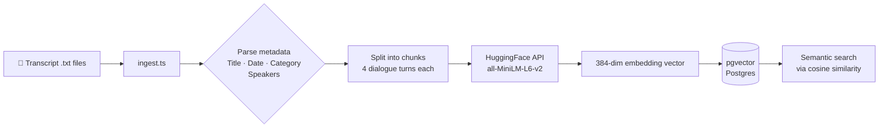

# Vector DB Transcripts

A learning project that turns tech discussion transcripts into a searchable semantic knowledge base using vector embeddings.

Each transcript is a conversation between two engineers on a focused topic. The pipeline parses, chunks, and embeds those conversations — storing them in a local pgvector database so you can search by meaning, not just keywords.

---

## How It Works



---

## Architecture

```
vector-db-transcripts/
├── transcripts/               # Raw .txt conversation files
│   ├── react-vs-vue.txt
│   ├── database-scaling.txt
│   ├── llms-in-production.txt
│   └── microservices-vs-monolith.txt
├── schema.sql                 # pgvector table definitions
├── embeddings-hf.ts           # Standalone embedding demo
├── ingest.ts                  # Full ingestion pipeline
└── .env                       # HF_TOKEN (not committed)
```

### Database Schema

```
transcripts                         transcript_chunks
──────────────────────────────      ─────────────────────────────────────
id            UUID (PK)             id                UUID (PK)
filename      TEXT                  transcript_id     UUID (FK)
title         TEXT                  chunk_index       INTEGER
category      ENUM                  chunk_text        TEXT
speakers      TEXT[]                speakers_in_chunk TEXT[]
recorded_date DATE                  embed_model       TEXT
created_at    TIMESTAMPTZ           embedding         vector(384)  ← HNSW index
                                    embedded_at       TIMESTAMPTZ
                                    created_at        TIMESTAMPTZ
```

---

## Why HuggingFace?

**HuggingFace Inference API** lets you run open-source embedding models without managing any infrastructure.

| | HuggingFace | OpenAI |
|---|---|---|
| Model ownership | Open source, self-hostable | Proprietary, API only |
| Cost | Free tier available | Pay per token |
| Deprecation risk | Low — pin a model version forever | Models get retired, forcing re-embedding |
| Embedding dims | 384 (MiniLM), 768 (mpnet) | 1536–3072 |
| Quality | Good for focused domains | Marginally better on benchmarks |

The model used here — `sentence-transformers/all-MiniLM-L6-v2` — is fast, free, and produces 384-dimensional embeddings that work well for semantic search over English text. For a production system with high recall requirements, you'd evaluate OpenAI's `text-embedding-3-large` or a larger HF model like `bge-large-en`.

---

## Why pgvector?

pgvector is a Postgres extension that adds a native `vector` column type and similarity search operators. It was chosen here because:

- **No new infrastructure** — it's just Postgres. Use pgAdmin, psql, or any Postgres client you already know.
- **SQL-native filtering** — combine vector search with regular WHERE clauses (e.g. filter by `category` or `recorded_date` before ranking by similarity).
- **HNSW index** — Hierarchical Navigable Small World index makes approximate nearest-neighbour search fast even at scale.
- **Familiar tooling** — migrations, backups, transactions all work exactly as they do in any Postgres database.

The alternative (Pinecone, Qdrant, Weaviate) offer more scale and dedicated UIs, but add operational complexity that isn't justified for a project at this size.

---

## Getting Started

### Prerequisites

- Node.js 18+
- Docker
- A HuggingFace account

---

### 1. Get a HuggingFace Token

You need a token with permission to call Inference Providers.

1. Go to [huggingface.co/settings/tokens](https://huggingface.co/settings/tokens)
2. Click **Create new token**
3. Select token type: **Fine-grained**

   

4. Under **Permissions**, enable **"Make calls to Inference Providers"**
5. Click **Generate token** and copy it

> **Note:** A classic "Read" token will authenticate but return a 403 — you specifically need the Inference Providers permission.

---

### 2. Start pgvector

```bash
docker run -d \
  --name pgvector \
  -e POSTGRES_PASSWORD=postgres \
  -e POSTGRES_USER=postgres \
  -e POSTGRES_DB=vectordb \
  -p 5433:5432 \
  pgvector/pgvector:pg16
```

Port 5433 is used to avoid conflicts with any local Postgres on 5432.

---

### 3. Install dependencies

```bash
npm install
```

---

### 4. Configure environment

```bash
cp .env.example .env
# Add your HuggingFace token
```

`.env`:
```
HF_TOKEN=hf_your_token_here
```

---

### 5. Apply the schema

```bash
psql -h localhost -p 5433 -U postgres -d vectordb -f schema.sql
# password: postgres
```

Or connect via pgAdmin:

| Field | Value |
|-------|-------|
| Host | `localhost` |
| Port | `5433` |
| Database | `vectordb` |
| Username | `postgres` |
| Password | `postgres` |

---

### 6. Run ingestion

```bash
npx tsx ingest.ts
```

This will:
- Parse each transcript file (metadata + dialogue)
- Split into chunks of 4 dialogue turns
- Embed each chunk via HuggingFace
- Insert into pgvector with full metadata

Expected output:
```
🚀 Ingesting transcripts...

📄 database-scaling.txt  (2023-11-05 · databases)
   Yusuf, Sandra · 16 turns → 4 chunks
   chunk 1/4 ... ✓
   chunk 2/4 ... ✓
   ...

✅ Done.
```

---

## Chunking Strategy

Transcripts are split into overlapping **exchanges of 4 turns** rather than fixed token windows. This preserves conversational context — a point made in one turn is often directly responded to in the next, and splitting mid-exchange loses that meaning.

```
Turn 1: Yusuf: We're starting to see query times creep up...
Turn 2: Sandra: First question — are you on indexes?
Turn 3: Yusuf: Yeah we have indexes on user_id and created_at separately...
Turn 4: Sandra: There's your problem. A composite index on (user_id, created_at)...
──────── chunk boundary ────────
Turn 5: Yusuf: I can add that. But even beyond the current bottleneck...
...
```

---

## Querying

Once ingested, you can run semantic search directly in SQL:

```sql
-- Find chunks most similar to a query vector
SELECT
  t.title,
  t.category,
  t.recorded_date,
  c.chunk_text,
  c.embedding <=> '[0.1, 0.2, ...]'::vector AS distance
FROM transcript_chunks c
JOIN transcripts t ON t.id = c.transcript_id
ORDER BY distance
LIMIT 5;
```

Filter by category or date range:

```sql
-- Only search architecture discussions from 2024 onwards
SELECT c.chunk_text, c.embedding <=> '[...]'::vector AS distance
FROM transcript_chunks c
JOIN transcripts t ON t.id = c.transcript_id
WHERE t.category = 'architecture'
  AND t.recorded_date >= '2024-01-01'
ORDER BY distance
LIMIT 3;
```

---

## Tech Stack

| Layer | Tool |
|-------|------|
| Language | TypeScript (tsx) |
| Embeddings | HuggingFace Inference API — `all-MiniLM-L6-v2` |
| Vector DB | pgvector (Postgres extension) |
| DB client | node-postgres (`pg`) |
| Local DB | Docker |
| GUI | pgAdmin |
